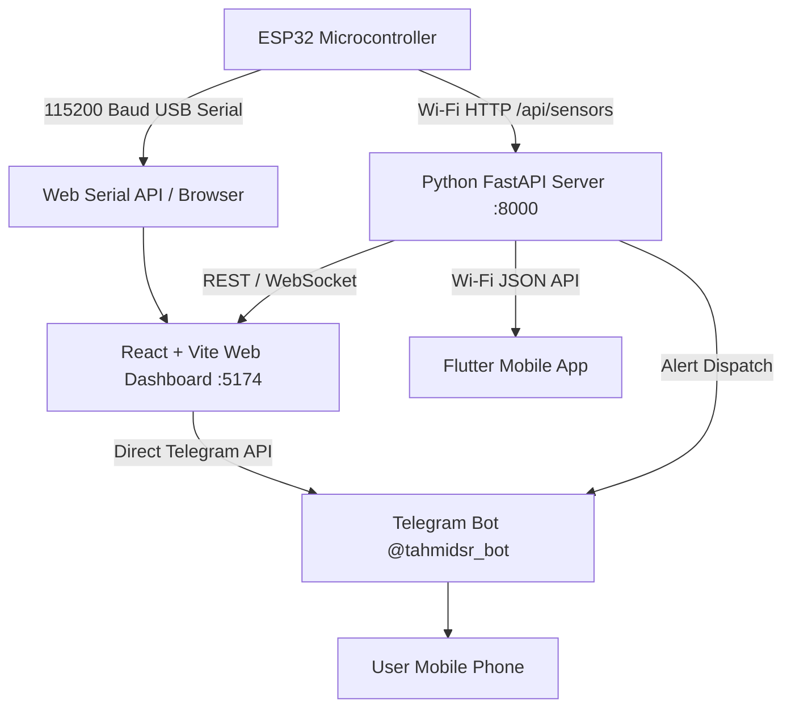

# 🏠 ESP32 Smart Home IoT System — Comprehensive Execution Guide

An end-to-end commercial-grade IoT monitoring and automation suite featuring real-time sensor visualization, dual connection modes (Web Serial USB + Python REST/WebSocket API), non-blocking ESP32 C++ firmware, Flutter mobile application, and instant Telegram Bot notifications with custom direct messaging.

---

## 📐 1. System Architecture Overview



### 🛰️ Monitored Sensors & Controlled Actuators
- **DHT11 Sensor:** Temperature (`°C`) & Humidity (`%`)
- **HC-SR04 Ultrasonic Sensor:** Proximity / Distance (`cm`)
- **LDR Sensor:** Ambient Light Level (`ADC 0–4095`)
- **MQ-2 Gas Sensor:** Gas Leak / Smoke Level (`PPM`)
- **Hardware Actuators:** Green LED (Safe), Red LED (Alert), Buzzer (Alarm), Relay (Power Control)

---

## 🛠️ 2. Prerequisites & Setup

Ensure the following tools are installed on your system:
- **Node.js:** `v18.0.0` or higher
- **Python:** `v3.9` or higher
- **Flutter SDK:** `v3.0.0` or higher (for mobile app)
- **Arduino IDE:** `v2.0` or higher (with ESP32 board package installed)
- **Web Browser:** Google Chrome, Microsoft Edge, or Brave (supports Web Serial API)

---

## 🚀 3. Running the Frontend Web Dashboard

The web dashboard is built using React 19, TypeScript, Vite, Tailwind CSS v4, Lucide Icons, and Recharts.

```bash
# 1. Navigate to project root directory
cd "/Volumes/Office Files/University Project/IOT"

# 2. Install dependencies (if not already installed)
npm install

# 3. Start Vite Development Server
npm run dev
```

- **Dashboard URL:** `http://localhost:5174/` (or port assigned by Vite)
- **Features:** 0ms instant Web Serial streaming, voice assistant controls, CSV report exporter, custom Telegram direct messenger modal, interactive threshold editor.

---

## 🐍 4. Running the Python FastAPI Backend

The backend provides REST endpoints, WebSockets, threshold evaluation, and Telegram alert dispatching.

```bash
# 1. Navigate to project root
cd "/Volumes/Office Files/University Project/IOT"

# 2. Install Python dependencies
pip install -r backend/requirements.txt

# 3. Start FastAPI server using Uvicorn
uvicorn backend.server:app --reload --port 8000
```

- **Backend REST URL:** `http://localhost:8000/api/sensors`
- **Swagger Interactive API Docs:** `http://localhost:8000/docs`

### 🌉 Python Serial Bridge (Optional Helper)
If you want the Python backend to read directly from your ESP32's USB Serial cable and forward telemetry to the API:

```bash
python backend/serial_bridge.py
```

---

## 🔌 5. ESP32 Arduino Firmware Setup (USB + Wi-Fi)

The ESP32 firmware (`esp32_wifi_firmware.ino`) runs non-blocking dual-mode operation (USB Serial @ 115200 baud + HTTP Web Server `/api/sensors`).

### 📌 Wiring Diagram
- **DHT11 Data:** Pin `GPIO 4`
- **HC-SR04 Trig:** Pin `GPIO 5`
- **HC-SR04 Echo:** Pin `GPIO 18`
- **LDR Analog:** Pin `GPIO 34`
- **MQ-2 Gas Analog:** Pin `GPIO 35`
- **Green LED:** Pin `GPIO 12`
- **Red LED:** Pin `GPIO 13`
- **Buzzer:** Pin `GPIO 14`
- **Relay:** Pin `GPIO 27`

### ⚡ Flashing Instructions
1. Open `esp32_wifi_firmware.ino` in **Arduino IDE**.
2. Select Board: `ESP32 Dev Module` (or `ESP32-WROOM-32`).
3. Select Serial Port (e.g. `/dev/cu.usbserial-0001` or `COM3`).
4. Click **Upload**.
5. Once uploaded, **CLOSE the Arduino IDE Serial Monitor** so the port is freed up for your Web Browser or Python bridge!

---

## 📱 6. Running the Flutter Mobile App

The mobile application provides single-page live telemetry monitoring and actuator status over Wi-Fi.

```bash
# 1. Navigate to mobile app directory
cd "/Volumes/Office Files/University Project/IOT/mobile_app"

# 2. Fetch Flutter packages
flutter pub get

# 3. Check for any static issues
flutter analyze

# 4. Launch app on connected phone or emulator
flutter run
```

---

## 🤖 7. Telegram Bot Config & Custom Direct Messaging

The system uses a dedicated Telegram Bot for instant threshold alerts and direct user messages.

- **Bot Token:** `8758639842:AAGweDOKzPxa8EoOR8noIJdyPLOqyG0JyVo`
- **Chat ID:** `8386717210` (`@tahmidsr_bot`)

### 💬 Sending Custom Messages from Frontend
1. Click the **"Telegram"** button in the dashboard top navigation bar.
2. Type any custom message or pick a quick preset (e.g. *"🚨 Low Distance Warning: Obstacle detected near entrance"*).
3. Click **"Send to Telegram"**.

---

## ⚡ 8. Troubleshooting & FAQ

### 🔒 `Port Locked (Errno 16)` Error
- **Cause:** Arduino IDE's Serial Monitor window or another app is currently holding the USB serial port lock.
- **Solution:** Close Arduino IDE's Serial Monitor window or unplug and re-plug the USB cable.

### 📶 ESP32 Wi-Fi Hotspot Connection
- iOS mobile hotspots format apostrophes as curly quotes (`’`).
- The firmware includes an **auto-scan matcher** that connects to any network containing `"Tahmid"` or `"iPhone"`.

### 🚨 Distance Reading Check
- Ensure HC-SR04 **Trig** is connected to `GPIO 5` and **Echo** to `GPIO 18`.
- If no obstacle is within range, distance reports `0.0 cm / Standby`. When an object approaches within `<= 20 cm`, a **Low Distance Alert** fires to Telegram!
